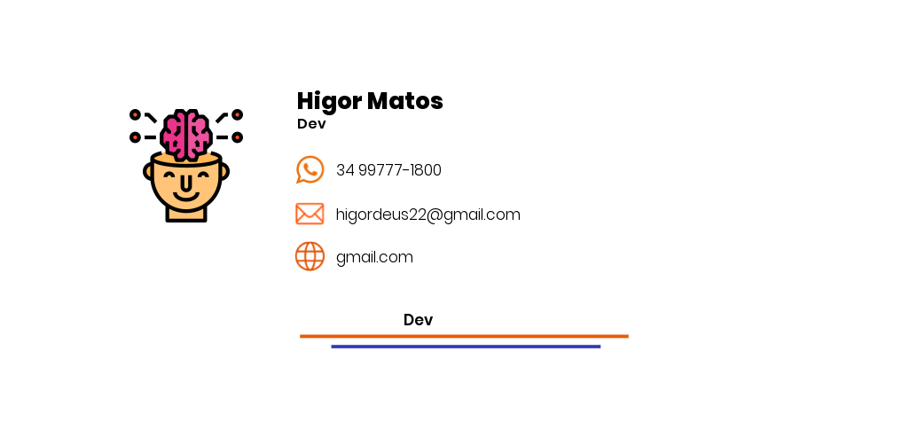
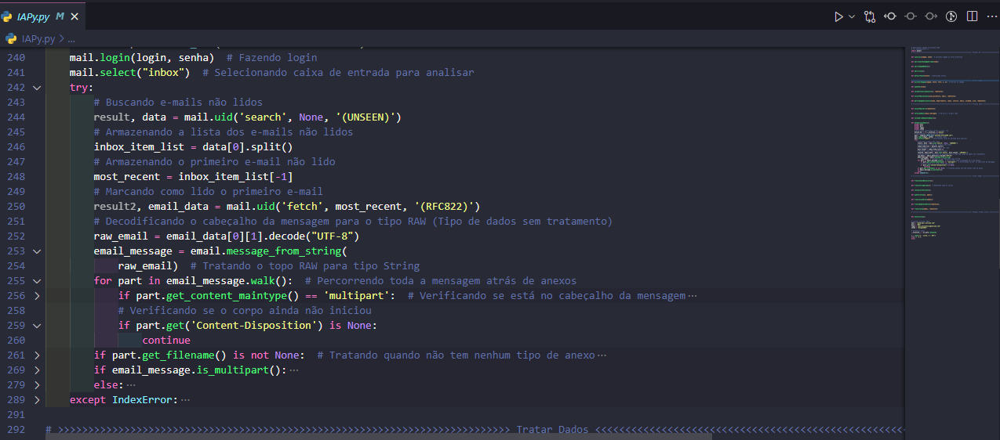

# Inteligência Artificial em Python 🐍 voltada para comunicação comercial

O projeto desenvolvido em Python tem como finalidade facilitar a interação dos usuários com o sistema.
A IA consegue receber e-mails, tratar e filtrar as demandas, comunicar com servidores e sistemas de terceiros e resolver a demanda devolvendo para o requisitante.
Nesse cenário, utilizei para gerar assinaturas de e-mail.


## Referências

 - [Enviando e recebendo emails com Python](https://humberto.io/pt-br/blog/enviando-e-recebendo-emails-com-python/#:~:text=Os%20Protocolos%20de%20email&text=Estes%20protocolos%20s%C3%A3o%20definidos%20e,entre%20sistemas%20como%20a%20internet.)
 - [Sending Emails With Python](https://realpython.com/python-send-email/)
 - [How to Read Emails in Python](https://www.thepythoncode.com/article/reading-emails-in-python)
 - [A Comprehensive Guide To Artificial Intelligence With Python](https://www.edureka.co/blog/artificial-intelligence-with-python/)


## Autores

- [@higor_dedeus](https://github.com/Higor-Matos)


## FAQ

#### Como o BOT funciona?

O bot consegue ler, tratar e filtrar todos os tipos de e-mail.
O usuário envia um e-mail com a demanda e o bot resolve e devolve ela concluída.
Para demonstração, configurei o BOT para gerar assinaturas de e-mail.

#### O BOT é seguro?

Sim. O bot conta com filtros anti-spam e métricas contra malwares podendo assim evitar problemas e contaminações.

#### Onde o BOT pode ser aplicado?

O bot é modular e adpatável, tudo envolvendo respostas e consultas via e-mail torna-se tangível. Exemplos de aplicação: possibilidade de requisitar segunda via de nota fiscal, recibo, gerar assinaturas corporativas (exemplo que foi usado nesse cenário para demonstração), aviso de férias, analisar status de processos de servidores e enviar alertas.

## Funcionalidades

- Ler e-mails
- Enviar e-mails
- Comunicar com servidores, banco de dados...
- Multiplataforma
- Online sem necessidade de fiscalização humana


## 🚀 Sobre mim
Desenvolvedor Python, Java e iniciante em Kotlin. Busco sempre melhorar e tornar os processos aos quais sou submetido mais rápidos e simples.


## 🔗 Link
[](https://www.linkedin.com/in/higor-de-deus-matos-3b0531207/)


## Screenshots
 Exemplo funcionando

 Exemplo de assinatura

 Código



## Uso/Exemplos

Enviar para: bot_assinaturas@outlook.com
```
Nome: Higor
Departamento: Dev
Celular: 00 00000-00000
Unidade: Desenvolvedor

```

